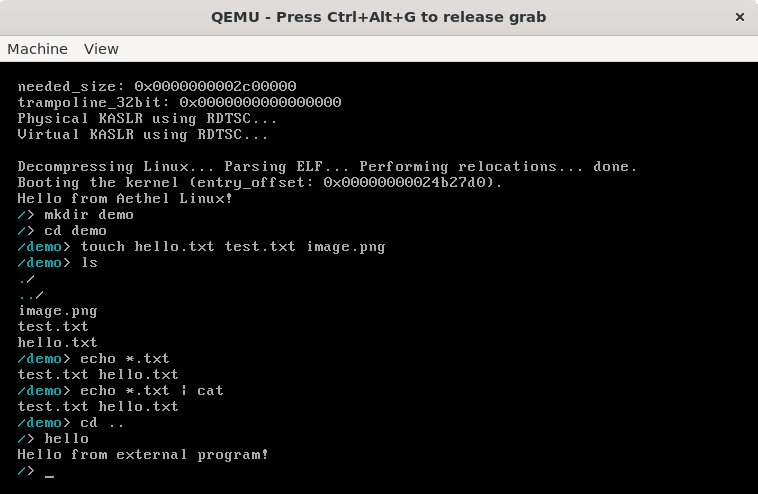

# Aethel Linux

Aethel Linux is a Linux distribution built from scratch, focused on learning, experimentation, and building a complete operating system environment from the ground up.

The project starts with a minimal custom userspace and gradually grows towards a usable Linux distribution with its own tools, package manager, graphical environment, and ecosystem.

> **Status: Early development**

## Goals

Aethel Linux aims to provide:

* A custom userspace built from the ground up
* A custom shell and system utilities
* A simple and understandable system architecture
* Its own package manager
* Support for graphical applications and desktop environments
* A growing collection of native Aethel packages
* An environment suitable for experimentation and systems programming

The project is intentionally developed step by step rather than trying to build everything at once.

## Current Features



Aethel currently includes:

* Custom PID 1 (`/init`)
* Custom shell
* Direct Linux syscall interface
* Process creation with `fork`
* Program execution with `execve`
* Process waiting
* Basic filesystem operations
* `ls`
* `cd`
* `pwd`
* `cat`
* `mkdir`
* `touch`
* `rm`
* `cp`
* `mv`
* `rmdir`
* `env`
* `PATH` support
* Environment variables
* Input/output redirection
* External ELF program execution
* `/proc` support
* Linux kernel boot through QEMU

## Architecture

Aethel currently uses the Linux kernel as its kernel layer while providing its own userspace.

```text
┌──────────────────────────────┐
│          Applications        │
├──────────────────────────────┤
│       Aethel Shell / Tools   │
├──────────────────────────────┤
│        Aethel Userspace      │
├──────────────────────────────┤
│        Linux System Calls    │
├──────────────────────────────┤
│          Linux Kernel        │
├──────────────────────────────┤
│           Hardware           │
└──────────────────────────────┘
```

The userspace is intentionally kept small and explicit. Most functionality is implemented directly on top of Linux system calls without relying on a traditional C library.

## Building

### Requirements

* Linux or WSL
* GCC
* GNU Make
* Git
* QEMU
* cpio

### Clone the repository

```bash
git clone https://github.com/viskasssssss/Aethel-Linux.git
cd Aethel-Linux
```

### Initialize the kernel submodule

```bash
git submodule update --init --depth 1
```

### Build

```bash
make
```

### Run

```bash
make run
```

Aethel will boot inside QEMU using the Linux kernel and the generated initramfs.

## Project Structure

```text
Aethel-Linux/
├── build/          # Build artifacts
├── kernel/         # Linux kernel submodule
├── rootfs/         # Aethel root filesystem
├── src/            # Aethel userspace source code
└── Makefile        # Build system
```

## Roadmap

Aethel is still in its early stages. Planned development includes:

* [ ] Dynamic memory allocation
* [ ] Environment variable management
* [ ] Shell variable expansion
* [ ] More system utilities
* [ ] Better filesystem support
* [ ] A C library / userspace runtime
* [ ] Shared libraries and dynamic linking
* [ ] A native package manager
* [ ] Package repositories
* [ ] System configuration tools
* [ ] Networking utilities
* [ ] Graphical environment
* [ ] Desktop applications
* [ ] Native Aethel applications
* [ ] A complete desktop experience

The roadmap is intentionally flexible and will evolve as the project develops.

## Package Manager

Aethel is planned to have its own package manager, **YoYo**.

The goal is to eventually make installing software as simple as:

```bash
yoyo install <package>
yoyo remove <package>
yoyo update
```

YoYo will become part of the Aethel userspace and package ecosystem as the project matures.

> Work on YoYo is already underway, and it may soon become part of Aethel.

## Contributing

Aethel is an open-source project and experimentation is encouraged.

You can:

* Fork the project
* Experiment with the userspace
* Add new utilities
* Improve existing components
* Create your own Aethel-based distribution
* Suggest features
* Submit pull requests

There are no strict rules about how your fork must work. Aethel is intended to be a foundation for experimentation as well as a distribution in its own right.

## License

Aethel Linux is licensed under the GNU General Public License v3.0 or later.

See the [LICENSE](LICENSE) file for the full license text.